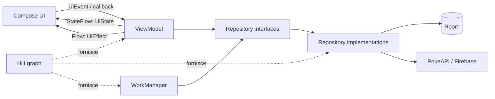
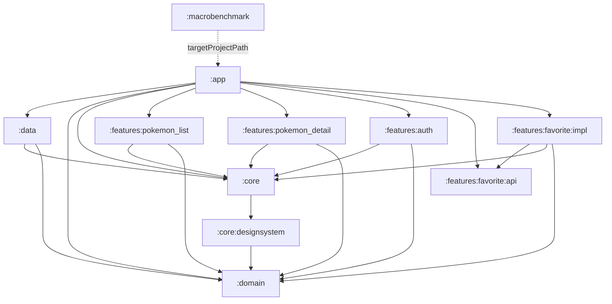
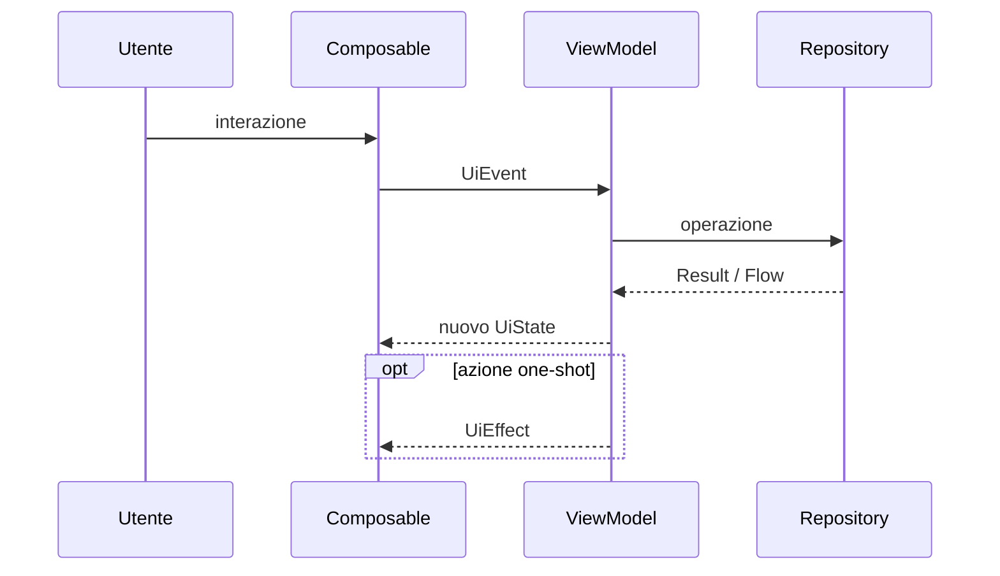
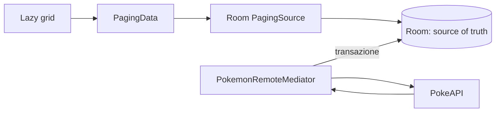

# Pokedex — Android Swiss Army Knife

Pokedex è un progetto Android didattico e un template personale riutilizzabile. L'applicazione è
volutamente più articolata del dominio Pokémon che rappresenta: lo scopo è raccogliere, in un unico
repository, pattern e strumenti utili per costruire applicazioni Android moderne.

Il progetto mostra come combinare:

- architettura multi-modulo e separazione tra UI, contratti di dominio e implementazioni;
- UI dichiarativa con Jetpack Compose, Material 3 e layout adattivi;
- stato unidirezionale in stile MVI/UDF;
- cache offline con Room, Paging 3 e `RemoteMediator`;
- dependency injection con Hilt;
- autenticazione e osservabilità con Firebase;
- lavoro persistente con WorkManager;
- test JVM, test UI locali e strumentati, screenshot test e test di performance;
- Navigation 3, deep link, app widget Glance e AppFunctions;
- build logic condivisa, version catalog, lint e continuous integration.

> Questo repository è prima di tutto un laboratorio. Alcune integrazioni sono intenzionalmente
> dimostrative o sperimentali; la sezione [Stato reale e limiti del template](#stato-reale-e-limiti-del-template)
> distingue ciò che è già robusto da ciò che va completato prima di usare il progetto in produzione.

## Indice

- [Funzionalità](#funzionalità)
- [Stack tecnico](#stack-tecnico)
- [Architettura](#architettura)
- [Moduli e dipendenze](#moduli-e-dipendenze)
- [Flusso dello stato e MVI](#flusso-dello-stato-e-mvi)
- [Data layer e strategia offline](#data-layer-e-strategia-offline)
- [Navigazione e UI adattiva](#navigazione-e-ui-adattiva)
- [Design system, accessibilità e localizzazione](#design-system-accessibilità-e-localizzazione)
- [Dependency injection](#dependency-injection)
- [Servizi di piattaforma](#servizi-di-piattaforma)
- [Strategia di test](#strategia-di-test)
- [Performance](#performance)
- [Qualità del codice e CI/CD](#qualità-del-codice-e-cicd)
- [KDoc](#kdoc)
- [Configurazione e avvio](#configurazione-e-avvio)
- [Come usare il repository come template](#come-usare-il-repository-come-template)
- [Stato reale e limiti del template](#stato-reale-e-limiti-del-template)
- [Documentazione ufficiale](#documentazione-ufficiale)

## Funzionalità

- elenco Pokémon paginato;
- ricerca per nome o identificativo;
- filtro per tipo;
- dettaglio con statistiche, altezza, peso, immagine e verso;
- preferiti persistiti localmente;
- autenticazione email/password e Google Sign-In;
- navigazione adattiva bottom bar/navigation rail;
- layout list-detail su finestre ampie;
- deep link `pokedex://pokemon/{id}`;
- sincronizzazione periodica dei primi Pokémon e prefetch delle immagini;
- widget Glance che mostra un Pokémon preferito;
- AppFunctions per cercare Pokémon e modificare i preferiti tramite agenti compatibili;
- tema chiaro/scuro, dynamic color e risorse inglesi/italiane;
- Analytics, Crashlytics e Remote Config dietro astrazioni di dominio.

## Stack tecnico

| Area | Tecnologie |
|---|---|
| Linguaggio e build | Kotlin, Kotlin DSL, Gradle Wrapper, AGP, KSP, Version Catalog |
| UI | Jetpack Compose, Material 3, Coil |
| Architettura UI | ViewModel, Coroutines, `StateFlow`, `Flow`, MVI/UDF |
| Navigazione | Navigation 3, chiavi serializzabili, Scenes list-detail |
| Persistenza | Room, DAO, PagingSource |
| Rete | Retrofit, OkHttp, Kotlinx Serialization |
| Paginazione | Paging 3, `Pager`, `RemoteMediator`, Paging Compose |
| Dependency injection | Hilt/Dagger |
| Background work | WorkManager, `CoroutineWorker`, Hilt Worker |
| Identità e cloud | Credential Manager, Google ID, Firebase Auth, Analytics, Crashlytics, Remote Config |
| Superfici Android | Glance App Widgets, AppFunctions |
| Test | JUnit 4/5, MockK, Coroutines Test, Turbine, Robolectric, Compose UI Test, Roborazzi, Compose Preview Screenshot Testing |
| Performance | Macrobenchmark, UI Automator, Baseline Profiles, ProfileInstaller |
| Qualità | Android Lint, ktlint, Detekt, GitHub Actions |

Le versioni sono centralizzate in
[`gradle/libs.versions.toml`](gradle/libs.versions.toml). I moduli Android condividono la
configurazione tramite convention plugin in [`build-logic`](build-logic/).

## Architettura

Il progetto applica una Clean Architecture pragmatica insieme alle raccomandazioni Android su
separation of concerns, single source of truth e unidirectional data flow.



### Responsabilità dei layer

**UI/presentation**

- rende uno `UiState` immutabile;
- inoltra eventi o callback al `ViewModel`;
- osserva gli effetti one-shot, per esempio navigazione o riproduzione audio;
- non crea direttamente repository, database o client di rete.

**Domain**

- definisce i modelli usati dall'app;
- espone i contratti `PokemonRepository`, `AuthRepository`, `SyncManager`,
  `AnalyticsLogger` e `FeatureFlagManager`;
- non conosce Retrofit, Room, Firebase o classi Android;
- permette alla UI di dipendere da astrazioni anziché da implementazioni.

Il modulo `:domain` usa `androidx.paging:paging-common` per esporre `PagingData`: è quindi privo di
Android framework, ma non completamente indipendente dalle librerie AndroidX.

**Data**

- implementa i repository;
- coordina rete, database, cache e mapping tra DTO, entity e modelli di dominio;
- contiene DAO, database Room, `RemoteMediator`, worker, client HTTP e adapter Firebase;
- espone le implementazioni al resto dell'app tramite binding Hilt.

**Application**

- avvia Hilt e WorkManager;
- compone i moduli;
- possiede la root navigation e le integrazioni strettamente legate all'app;
- produce l'APK/AAB finale.

Questa struttura segue il principio di dependency inversion: UI e logica di alto livello vedono
interfacce nel dominio, mentre `:data` fornisce le implementazioni concrete.

## Moduli e dipendenze



| Modulo | Responsabilità |
|---|---|
| `:app` | Entry point, `Application`, `MainActivity`, Navigation 3, deep link, widget, AppFunctions e composizione finale |
| `:core` | Primitive MVI, coroutine dispatcher, scope applicativo, risorse condivise e utility UI |
| `:core:designsystem` | Tema, colori, tipografia, dimensioni, pesi, animazioni e componenti Compose condivisi |
| `:domain` | Modelli e contratti indipendenti dalle implementazioni |
| `:data` | Retrofit/OkHttp, Room, Paging, repository, Firebase, WorkManager e moduli Hilt |
| `:features:pokemon_list` | Elenco, ricerca, filtro, paginazione e relativi test |
| `:features:pokemon_detail` | Dettaglio, preferiti e riproduzione del verso |
| `:features:auth` | Login, registrazione, profilo e Google Sign-In con Credential Manager |
| `:features:favorite:api` | Contratto di navigazione pubblico della feature preferiti |
| `:features:favorite:impl` | UI e ViewModel dei preferiti |
| `:macrobenchmark` | Test di startup/scroll e generazione Baseline Profile |
| `build-logic` | Convention plugin per uniformare SDK, Java/Kotlin, Compose e Hilt |

La cartella `features/` raggruppa i moduli per responsabilità senza modificare il loro ruolo
architetturale. La suddivisione `:features:favorite:api`/`:features:favorite:impl` mostra inoltre
come separare un contratto stabile dalla sua implementazione. Non è obbligatorio replicare questa
granularità per ogni feature: nei progetti piccoli il costo di troppi moduli può superare il
beneficio.

## Flusso dello stato e MVI

Le feature lista e dettaglio usano le primitive definite in `:core`:

- `UiState`: fotografia immutabile di ciò che la UI deve mostrare;
- `UiEvent`: intenzione dell'utente o evento di sistema;
- `UiEffect`: azione one-shot che non appartiene allo stato persistente;
- `BaseViewModel<S, E, F>`: riduce gli eventi in stato ed effetti.



Implementazione:

- lo stato è esposto come `StateFlow`;
- gli eventi entrano in un `MutableSharedFlow`;
- gli effetti sono inviati su un `Channel` ed esposti come `Flow`;
- `setState` applica una funzione riduttrice allo stato corrente;
- `viewModelScope` lega le coroutine al ciclo di vita del `ViewModel`.

La feature auth adotta lo stesso principio UDF, ma usa direttamente un `MutableStateFlow` anziché
ereditare da `BaseViewModel`. È una scelta utile nel template: mostra che il pattern va applicato
solo dove riduce complessità, senza trasformare la classe base in un vincolo universale.

Per mantenere i composable testabili, è preferibile separare:

- un composable route/stateful che recupera il `ViewModel` e raccoglie i `Flow`;
- un composable screen/stateless che riceve stato e callback.

## Data layer e strategia offline

### Elenco paginato

Il flusso principale segue il pattern network + database di Paging 3:



1. la UI raccoglie `PagingData<Pokemon>`;
2. il `Pager` legge sempre gli elementi dal `PagingSource` generato dal DAO;
3. quando servono altri dati, `PokemonRemoteMediator` interroga la rete;
4. dettagli e remote key vengono salvati in una transazione Room;
5. Room invalida il `PagingSource` e la UI riceve i dati aggiornati.

Per questo percorso Room è la single source of truth: il `RemoteMediator` non consegna direttamente
la risposta HTTP alla UI.

### Ricerca, filtro e dettaglio

- la ricerca è normalizzata e debounced nel `ViewModel`;
- il repository mantiene in memoria l'indice globale restituito dalla PokeAPI e scarica i dettagli
  richiesti;
- il filtro per tipo viene applicato al `PagingData`;
- il dettaglio è local-first: restituisce la entity Room se presente, altrimenti usa la rete e la
  persiste;
- lo stato `isFavorite` viene preservato quando un elemento remoto aggiorna la cache.

### Sincronizzazione

`SyncWorker` usa WorkManager per:

- aggiornare periodicamente un sottoinsieme di Pokémon;
- rispettare il vincolo di connettività;
- salvare i dati attraverso il repository;
- precaricare le immagini con Coil;
- restituire `retry()` in caso di errore recuperabile.

`WorkManagerSyncManager` espone inoltre una sincronizzazione manuale unica e un `Flow<Boolean>` con
lo stato del lavoro.

## Navigazione e UI adattiva

La root navigation usa Navigation 3:

- ogni destinazione è un `NavKey` serializzabile;
- il back stack è una lista osservabile controllata dall'app;
- `NavDisplay` associa le chiavi ai contenuti;
- l'autenticazione determina la destinazione iniziale;
- un listener Firebase riporta alla schermata auth quando la sessione termina;
- il deep link `pokedex://pokemon/{id}` apre il dettaglio immediatamente o dopo il login.

`NavigationSuiteScaffold` sceglie la navigazione più adatta allo spazio disponibile. La strategia
`ListDetailSceneStrategy` mostra lista e dettaglio insieme quando la finestra lo permette e torna
alla navigazione a singolo pannello su finestre compatte.

La decisione è basata sulla finestra corrente, non sul nome del dispositivo: questo rende il layout
compatibile anche con split screen, foldable e desktop windowing.

## Design system, accessibilità e localizzazione

Il modulo `:core:designsystem` centralizza:

- color scheme chiaro e scuro;
- dynamic color da Android 12;
- tipografia;
- token di spaziatura, dimensione, peso e animazione;
- componenti riutilizzabili come `PokemonCard`;
- `CompositionLocal` per distribuire i token senza parametri ripetitivi.

`PokedexTheme` applica token dimensionali differenti sopra e sotto i 600 dp. La root activity usa
edge-to-edge; le singole schermate devono quindi consumare correttamente gli inset di sistema.

### Regole di design per estendere il template

1. Usare i token del design system, non valori `dp`, colori o durate sparsi nelle feature.
2. Hoistare lo stato: i componenti riutilizzabili ricevono dati e callback.
3. Preferire componenti Material 3, personalizzandoli attraverso il tema.
4. Progettare per la dimensione della finestra e verificare almeno larghezze compact, medium ed
   expanded.
5. Aggiungere preview per tema chiaro/scuro, font scale elevata e dimensioni significative.
6. Usare semantic matcher nei test; ricorrere a `testTag` solo quando la semantica non identifica
   chiaramente il nodo.
7. Fornire `contentDescription` alle immagini informative e lasciare `null` per quelle puramente
   decorative.
8. Mantenere target touch adeguati e verificare TalkBack, contrasto e ridimensionamento testo.

Le risorse condivise hanno varianti inglesi e italiane e il manifest supporta RTL. Alcune stringhe
della navigazione e del widget sono ancora hardcoded: prima di considerare completa la
localizzazione vanno spostate nelle risorse e testate in entrambe le lingue.

## Dependency injection

Hilt costruisce il grafo delle dipendenze e ne gestisce gli scope:

- `@HiltAndroidApp` inizializza il container applicativo;
- `@AndroidEntryPoint` abilita l'injection nella `MainActivity`;
- `@HiltViewModel` fornisce repository e configurazione ai ViewModel;
- `@Binds` collega interfacce di dominio e implementazioni data;
- `@Provides` costruisce tipi di librerie esterne come Room, Retrofit e Firebase;
- `HiltWorkerFactory` permette l'injection nel `SyncWorker`;
- un Hilt entry point rende il repository disponibile al widget Glance.

Nei test, la dipendenza diretta da interfacce permette di usare fake o mock deterministici. Per test
strumentati dell'intero grafo si può aggiungere `hilt-android-testing` e sostituire i binding di
produzione con fake o database in-memory.

## Servizi di piattaforma

### Autenticazione e sessione

- Firebase Auth gestisce email/password e token Google;
- Credential Manager realizza il flusso Google Sign-In;
- `AuthRepository` nasconde Firebase al livello presentation;
- `SessionManager`, `AuthInterceptor` e `TokenAuthenticator` mostrano come strutturare
  l'autenticazione HTTP.

La PokeAPI pubblica usata dal progetto non offre un endpoint di refresh token: l'authenticator è
quindi uno scheletro didattico e `refreshToken()` restituisce attualmente `null`.

### Osservabilità e configurazione remota

`AnalyticsLogger` e `FeatureFlagManager` sono contratti di dominio. Le implementazioni Firebase
possono registrare eventi, proprietà utente, eccezioni non fatali e leggere feature flag senza
accoppiare ViewModel e UI agli SDK cloud.

Firebase Messaging è presente nel bundle delle dipendenze, ma non esiste ancora un flusso di push
notification nel codice.

### App widget

`PokedexWidget` usa Glance per mostrare un preferito letto dal repository. Glance usa il runtime di
Compose, ma produce `RemoteViews` e offre un insieme di composable distinto dalla UI Compose
normale. Il widget usa per ora un'immagine statica: per mostrare immagini remote è necessario
scaricarle fuori dalla composizione e fornire un bitmap locale.

### AppFunctions

`PokedexAppFunctions` espone due operazioni al sistema:

- `searchPokemon(query)`;
- `toggleFavorite(pokemonId, isFavorite)`.

AppFunctions è una API sperimentale disponibile sui dispositivi supportati. Le KDoc delle funzioni
sono parte del contratto: `isDescribedByKDoc = true` permette agli agenti di capire scopo,
parametri, risultato e ordine corretto delle chiamate.

## Strategia di test

La strategia segue una piramide: molti test locali veloci, meno test di integrazione e UI, pochissimi
test end-to-end e di performance.

### Suite presenti

| Tipo | Source set / modulo | Cosa verifica | Ambiente |
|---|---|---|---|
| Unit test | `src/test`, `:data` | repository, fallback locale/remoto, `RemoteMediator`, worker | JVM, con MockK/Coroutines Test; Robolectric dove serve Android |
| ViewModel test | `src/test`, `:features:pokemon_list` | stato, eventi ed effetti | JVM, JUnit 5, Turbine |
| UI behavior test locale | `src/test`, `:features:pokemon_list` | rendering Compose con stato controllato | Robolectric |
| Screenshot test Roborazzi | `src/test`, `:features:pokemon_list` | regressioni visive della schermata | JVM/Robolectric |
| Preview screenshot test | `src/screenshotTest` | regressioni visive di una preview/componente | LayoutLib, plugin ufficiale sperimentale |
| UI test strumentato | `src/androidTest`, `:features:pokemon_list` | contenuto Compose su device/emulatore | AndroidJUnitRunner |
| Macrobenchmark | `:macrobenchmark` | startup e frame timing durante lo scroll | device/emulatore separato dal processo app |
| Baseline Profile | `:macrobenchmark` → `:app` | critical user journey da precompilare | device compatibile |

### Unit test

Un unit test verifica una singola unità di logica senza dipendenze reali lente o instabili.

- repository e ViewModel ricevono mock/fake;
- `runTest` controlla il tempo virtuale delle coroutine;
- Turbine osserva `Flow` e sequenze di emissioni;
- i dispatcher sono iniettati, così il test non dipende da `Dispatchers.IO` reale;
- Activity, composable puramente dichiarativi e moduli DI non sono buoni candidati per unit test.

```bash
# Tutti i test locali di tutti i moduli
./gradlew test

# Variante debug
./gradlew testDebugUnitTest

# Solo il modulo della lista
./gradlew :features:pokemon_list:testDebugUnitTest
```

### Integration test

Un integration test verifica la collaborazione tra più componenti reali, per esempio:

- repository + Room in-memory;
- `RemoteMediator` + DAO + transazioni Room;
- Worker + WorkManager TestDriver + repository fake;
- grafo Hilt di test + feature.

I test repository correnti coprono bene l'orchestrazione con collaboratori sostituiti, ma non
validano ancora il vero motore SQLite. Il prossimo test ad alto valore è un test strumentato di
`PokemonDao`/`PokedexDatabase` con Room in-memory; Android raccomanda il device perché la versione di
SQLite del dispositivo può differire da quella host. Quando verranno introdotte migrazioni, vanno
aggiunti anche i migration test con schema esportato.

### UI behavior test

I test Compose interrogano l'albero semantico, eseguono azioni e verificano il risultato. Un test
robusto dovrebbe:

- impostare uno stato deterministico;
- cercare nodi per testo, ruolo, descrizione o altra semantica;
- eseguire click, input o scroll;
- verificare lo stato visibile risultante;
- coprire loading, contenuto, vuoto ed errore;
- verificare il ripristino dello stato dopo ricreazione;
- non dipendere dalla rete reale.

```bash
# Richiede un device o emulatore connesso
./gradlew :features:pokemon_list:connectedDebugAndroidTest

# Tutti gli androidTest disponibili
./gradlew connectedAndroidTest
```

### Screenshot test

Gli screenshot test validano l'aspetto, non il comportamento.

Roborazzi:

```bash
# Confronta con le immagini approvate
./gradlew :features:pokemon_list:verifyRoborazziDebug

# Rigenera intenzionalmente le reference
./gradlew :features:pokemon_list:recordRoborazziDebug
```

Compose Preview Screenshot Testing:

```bash
# Valida le preview contro le reference
./gradlew :features:pokemon_list:validateDebugScreenshotTest

# Aggiorna intenzionalmente le reference
./gradlew :features:pokemon_list:updateDebugScreenshotTest
```

Le reference Roborazzi vivono in `features/pokemon_list/src/test/screenshots`; quelle del plugin
ufficiale in `features/pokemon_list/src/screenshotTestDebug/reference`. Un aggiornamento delle
reference è una modifica funzionale da revisionare visivamente, non un modo per rendere verde un
test.

Per rendere la suite adattiva, aggiungere casi screen-level per larghezze compact, medium ed expanded,
tema chiaro/scuro e font scale 1.5, oltre a variazioni mirate dei componenti condivisi.

### End-to-end e navigation test

Un vero E2E attraversa l'app come un utente e usa implementazioni quanto più vicine possibile alla
produzione. Deve rimanere raro perché è più lento e fragile.

Percorsi consigliati:

1. login → lista → ricerca → dettaglio → preferito;
2. apertura deep link da utente autenticato e non autenticato;
3. back handling e passaggio tra tab;
4. persistenza offline dopo un primo caricamento;
5. logout e pulizia del back stack.

La suite attuale non contiene ancora questi E2E funzionali. UI Automator è già disponibile nel
modulo macrobenchmark, ma oggi viene usato per performance e generazione profili.

### Cosa eseguire in CI

Una pipeline completa dovrebbe eseguire, in ordine:

```bash
./gradlew ktlintCheck detekt lintDebug
./gradlew testDebugUnitTest
./gradlew :features:pokemon_list:verifyRoborazziDebug
./gradlew :features:pokemon_list:validateDebugScreenshotTest
./gradlew assembleDebug
```

I test strumentati, gli E2E e i benchmark richiedono inoltre emulatori, Gradle Managed Devices o
device dedicati. La CI corrente compila gli androidTest e i preview screenshot test, ma non li
esegue su device e non esegue ancora `validateDebugScreenshotTest`.

## Performance

Il modulo `:macrobenchmark` misura l'app dall'esterno, in un processo separato:

- startup con `StartupTimingMetric`;
- fluidità dello scroll con `FrameTimingMetric`;
- critical user journey con UI Automator;
- generazione del Baseline Profile.

```bash
# Richiede un device/emulatore idoneo
./gradlew :macrobenchmark:connectedNonMinifiedReleaseAndroidTest

# Genera e copia il profilo nella variante dell'app
./gradlew :app:generateBaselineProfile
```

Un Baseline Profile indica ad ART i percorsi da compilare ahead-of-time e migliora startup e
interazioni critiche già dal primo avvio. Non equivale a un benchmark: il profilo ottimizza, mentre
Macrobenchmark misura. Per verificare il beneficio bisogna confrontare build equivalenti con e senza
profilo, preferibilmente su hardware fisico stabile.

## Qualità del codice e CI/CD

```bash
# Formattazione
./gradlew ktlintCheck
./gradlew ktlintFormat

# Analisi statica Kotlin
./gradlew detekt

# Analisi Android
./gradlew lintDebug

# Build
./gradlew assembleDebug
./gradlew bundleRelease
```

I baseline Detekt esistenti rappresentano debito tecnico accettato: non devono diventare un luogo in
cui nascondere automaticamente nuove violazioni.

GitHub Actions contiene:

- una pipeline CI che esegue style check, analisi statica, unit test, verifica Roborazzi,
  compilazione dei test Android/screenshot, build macrobenchmark, lint e APK debug;
- una pipeline CD attivata dai tag `v*`, che ricostruisce `google-services.json`, produce e firma
  l'AAB e carica l'artefatto;
- uno step Play Store predisposto ma commentato.

## KDoc

La KDoc non deve ripetere il nome della classe. In un template didattico deve spiegare soprattutto
decisioni e contratti che il tipo non rende evidenti.

### Cosa documentare

- API pubbliche tra moduli;
- invarianti e ownership dello stato;
- thread, dispatcher e comportamento di cancellazione;
- caching, fallback, retry ed effetti collaterali;
- formati, unità di misura e valori limite;
- errori attesi e significato dei `Result`;
- workflow richiesti da AppFunctions;
- estensioni pensate per essere riusate.

Usare `@param`, `@property`, `@return`, `@throws`, `@see` e link `[Tipo]` quando aggiungono
informazione reale. Per API interne e codice autoesplicativo è spesso migliore un buon nome rispetto
a una KDoc generica.

### Stato attuale

La documentazione è parziale:

- contratti di dominio, networking, sync, analytics e AppFunctions hanno già KDoc utile;
- molte API pubbliche di navigazione, design system, database e feature non sono documentate;
- alcune KDoc sono boilerplate (“responsible for ... logic”) e non descrivono invarianti o side
  effect;
- lingua italiana e inglese sono mischiate;
- non è configurato Dokka, quindi non viene generato né verificato un sito di API documentation.

Priorità consigliata: contratti `domain` → primitive `core` → API tra feature → data source con
comportamenti non ovvi → componenti del design system. Le KDoc delle AppFunctions hanno priorità
massima perché vengono consumate anche dagli agenti.

## Configurazione e avvio

### Prerequisiti

- Android Studio compatibile con AGP dichiarato nel version catalog;
- JDK 21 per allinearsi al wrapper/daemon e al target Java del modulo `:domain`;
- Android SDK corrispondente a `compileSdk = 37`;
- un emulatore o device API 24+ per l'app;
- un progetto Firebase personale per usare davvero autenticazione e osservabilità.

I moduli Android compilano bytecode Java/Kotlin 17; `:domain` dichiara attualmente Java 21.

### Firebase

1. Creare un'app Android Firebase con package `com.example.pokedex`.
2. Copiare il proprio file in `app/google-services.json`.
3. Abilitare Authentication email/password e Google.
4. Configurare Analytics, Crashlytics e Remote Config se si vogliono provare le relative
   integrazioni.
5. Se `default_web_client_id` non viene generato dal file Google Services, passare
   `WEB_CLIENT_ID` come proprietà Gradle locale:

```properties
# ~/.gradle/gradle.properties
WEB_CLIENT_ID=your-web-client-id.apps.googleusercontent.com
```

`google-services.json`, `local.properties` e i keystore sono ignorati da Git: non committare
credenziali o materiale di firma.

### Build e run

```bash
git clone <repository-url>
cd pokedex
./gradlew assembleDebug
```

Aprire quindi il progetto in Android Studio ed eseguire la configurazione `:app`.

Per provare un deep link:

```bash
adb shell am start \
  -a android.intent.action.VIEW \
  -d "pokedex://pokemon/25" \
  com.example.pokedex
```

## Come usare il repository come template

Per aggiungere una feature:

1. creare un modulo Android library e applicare `pokedex.android.feature`;
2. dipendere da `:domain` e `:core`, evitando dipendenze dirette da `:data`;
3. definire state, event ed effect solo se la complessità giustifica MVI;
4. creare una route stateful e una screen stateless;
5. aggiungere una `NavKey` serializzabile e registrarla nell'`entryProvider`;
6. aggiungere eventuali contratti al dominio e implementarli in `:data`;
7. fornire i binding Hilt;
8. aggiungere unit test della logica, UI behavior test e preview/screenshot significative;
9. verificare compact/medium/expanded, dark mode, font scale e accessibilità;
10. aggiornare README e KDoc delle API tra moduli.

Per sostituire il dominio Pokémon:

- mantenere `:core`, `build-logic` e l'impianto test;
- sostituire modelli e repository in `:domain`;
- sostituire API, entity, DAO e mapping in `:data`;
- rinominare package/application ID e configurare un nuovo progetto Firebase;
- eliminare le integrazioni non utili: un coltellino svizzero funziona meglio quando si portano solo
  gli strumenti necessari.

## Stato reale e limiti del template

Questi punti sono intenzionali o ancora da completare:

- la Clean Architecture è pragmatica: `:core:designsystem` dipende da `:domain` per `PokemonCard`;
  per un design system totalmente generico il componente va spostato nella feature o reso
  indipendente dal modello di dominio;
- la lista è paginata con Paging 3/`RemoteMediator`, non con infinite scroll custom;
- il dettaglio local-first non ha una policy di scadenza della cache;
- filtro per tipo e ricerca globale sono implementazioni didattiche, non un motore query scalabile;
- `SessionManager.refreshToken()` è uno stub perché PokeAPI non offre auth;
- Firebase Messaging è dipendenza non ancora usata;
- AppFunctions e Compose Preview Screenshot Testing sono API sperimentali;
- il widget usa un asset statico invece dell'immagine remota;
- alcune stringhe sono ancora hardcoded;
- mancano test Room su SQLite reale, migration test, navigation test ed E2E funzionali;
- la CI compila ma non esegue i test che richiedono device;
- KDoc e documentazione API non hanno ancora enforcement Dokka;
- i target Java della CI e del modulo `:domain` vanno mantenuti allineati quando si modifica la
  toolchain.

## Documentazione ufficiale

Le scelte descritte in questo README derivano principalmente da queste fonti:

### Architettura e modularizzazione

- [Guide to app architecture](https://developer.android.com/topic/architecture)
- [UI layer e unidirectional data flow](https://developer.android.com/topic/architecture/ui-layer)
- [Data layer](https://developer.android.com/topic/architecture/data-layer)
- [Guide to Android app modularization](https://developer.android.com/topic/modularization)
- [Common modularization patterns](https://developer.android.com/topic/modularization/patterns)

### Dati, dependency injection e background work

- [Paging da rete e database con RemoteMediator](https://developer.android.com/topic/libraries/architecture/paging/v3-network-db)
- [Room](https://developer.android.com/training/data-storage/room)
- [Dependency injection con Hilt](https://developer.android.com/training/dependency-injection/hilt-android)
- [WorkManager e persistent work](https://developer.android.com/develop/background-work/background-tasks/persistent)

### UI, navigazione e design

- [Navigation 3](https://developer.android.com/guide/navigation/navigation-3)
- [Navigation 3 Scenes](https://developer.android.com/guide/navigation/navigation-3/scenes)
- [Build adaptive apps](https://developer.android.com/develop/ui/compose/build-adaptive-apps)
- [Window size classes](https://developer.android.com/develop/adaptive-apps/guides/use-window-size-classes)
- [Design systems in Compose](https://developer.android.com/develop/ui/compose/designsystems)
- [Material 3 in Compose](https://developer.android.com/develop/ui/compose/designsystems/material3)
- [Semantics e accessibilità](https://developer.android.com/develop/ui/compose/accessibility/semantics)

### Test e performance

- [Fundamentals of testing Android apps](https://developer.android.com/training/testing/fundamentals)
- [What to test in Android](https://developer.android.com/training/testing/fundamentals/what-to-test)
- [Compose UI testing](https://developer.android.com/develop/ui/compose/testing)
- [Automate UI tests](https://developer.android.com/training/testing/ui-tests)
- [Test Room databases](https://developer.android.com/training/data-storage/room/testing-db)
- [Compose Preview Screenshot Testing](https://developer.android.com/studio/preview/compose-screenshot-testing)
- [Macrobenchmark](https://developer.android.com/topic/performance/benchmarking/macrobenchmark-overview)
- [Create Baseline Profiles](https://developer.android.com/topic/performance/baselineprofiles/create-baselineprofile)

### Superfici e integrazioni

- [Jetpack Glance](https://developer.android.com/develop/ui/compose/glance)
- [Create an app widget with Glance](https://developer.android.com/develop/ui/compose/glance/create-app-widget)
- [AppFunctions overview](https://developer.android.com/ai/appfunctions)
- [Firebase documentation](https://firebase.google.com/docs/android/setup)

PokeAPI è il servizio dimostrativo usato per i dati:
[PokeAPI documentation](https://pokeapi.co/docs/v2).
