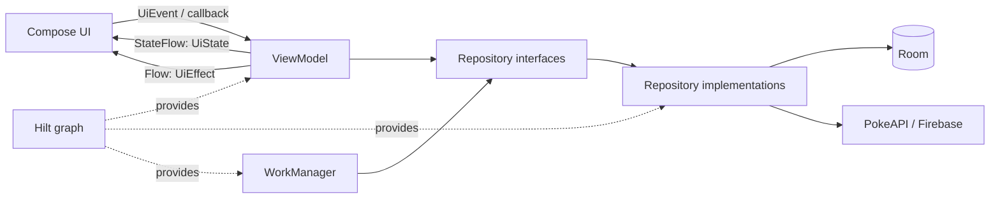
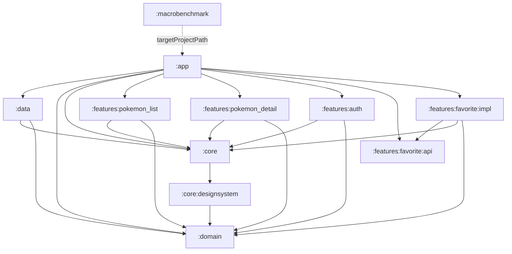
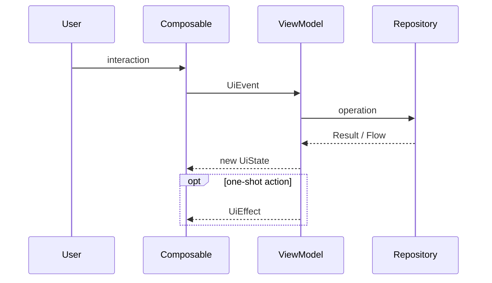
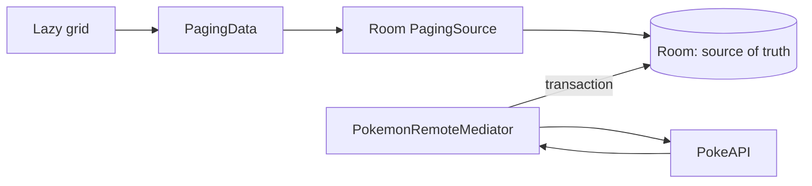

# Pokedex — Android Swiss Army Knife

Pokedex is an educational Android project and a reusable personal template. The application is
intentionally more sophisticated than its Pokémon domain requires: its purpose is to keep modern
Android patterns, integrations, and development tools together in one practical repository.

The project demonstrates how to combine:

- multi-module architecture and separation between UI, domain contracts, and implementations;
- declarative UI with Jetpack Compose, Material 3, and adaptive layouts;
- unidirectional state management inspired by MVI and UDF;
- offline caching with Room, Paging 3, and `RemoteMediator`;
- dependency injection with Hilt;
- authentication and observability with Firebase;
- persistent background work with WorkManager;
- JVM, local UI, instrumented UI, screenshot, and performance tests;
- Navigation 3, deep links, Glance widgets, and AppFunctions;
- shared build logic, a version catalog, static analysis, and continuous integration.

> This repository is primarily a learning laboratory. Some integrations are intentionally
> demonstrative or experimental. [Template status and limitations](#template-status-and-limitations)
> distinguishes completed infrastructure from work that is still required before production use.

## Table of contents

- [Features](#features)
- [Technology stack](#technology-stack)
- [Architecture](#architecture)
- [Modules and dependencies](#modules-and-dependencies)
- [State flow and MVI](#state-flow-and-mvi)
- [Data layer and offline strategy](#data-layer-and-offline-strategy)
- [Navigation and adaptive UI](#navigation-and-adaptive-ui)
- [Design system, accessibility, and localization](#design-system-accessibility-and-localization)
- [Dependency injection](#dependency-injection)
- [Platform services](#platform-services)
- [Testing strategy](#testing-strategy)
- [Performance](#performance)
- [Code quality and CI/CD](#code-quality-and-cicd)
- [KDoc and API documentation](#kdoc-and-api-documentation)
- [Setup and running the app](#setup-and-running-the-app)
- [Using the repository as a template](#using-the-repository-as-a-template)
- [Template status and limitations](#template-status-and-limitations)
- [Official documentation](#official-documentation)

## Features

- paginated Pokémon list;
- search by name or numeric identifier;
- filtering by Pokémon type;
- detail screen with statistics, height, weight, image, and cry playback;
- locally persisted favorites;
- email/password authentication and Google Sign-In;
- adaptive bottom navigation or navigation rail;
- list-detail presentation on wider windows;
- `pokedex://pokemon/{id}` deep links;
- periodic synchronization and image prefetching;
- a Glance widget that displays a favorite Pokémon;
- AppFunctions for searching and changing favorites through compatible agents;
- light/dark themes, dynamic color, and English/Italian resources;
- Analytics, Crashlytics, and Remote Config behind domain abstractions.

## Technology stack

| Area | Technologies |
|---|---|
| Language and build | Kotlin, Kotlin DSL, Gradle Wrapper, AGP, KSP, Version Catalog |
| UI | Jetpack Compose, Material 3, Coil |
| UI architecture | ViewModel, Coroutines, `StateFlow`, `Flow`, MVI/UDF |
| Navigation | Navigation 3, serializable keys, list-detail scenes |
| Persistence | Room, DAO, PagingSource |
| Networking | Retrofit, OkHttp, Kotlinx Serialization |
| Pagination | Paging 3, `Pager`, `RemoteMediator`, Paging Compose |
| Dependency injection | Hilt/Dagger |
| Background work | WorkManager, `CoroutineWorker`, Hilt Worker |
| Identity and cloud | Credential Manager, Google ID, Firebase Auth, Analytics, Crashlytics, Remote Config |
| Android surfaces | Glance App Widgets, AppFunctions |
| Testing | JUnit 4/5, MockK, Coroutines Test, Turbine, Robolectric, Compose UI Test, Roborazzi, Compose Preview Screenshot Testing |
| Performance | Macrobenchmark, UI Automator, Baseline Profiles, ProfileInstaller |
| Quality | Android Lint, ktlint, Detekt, GitHub Actions |

Dependency versions are centralized in
[`gradle/libs.versions.toml`](gradle/libs.versions.toml). Android modules share configuration through
convention plugins in [`build-logic`](build-logic/).

## Architecture

The project applies a pragmatic Clean Architecture approach together with the Android
recommendations for separation of concerns, a single source of truth, and unidirectional data flow.



### Layer responsibilities

**UI and presentation**

- render an immutable `UiState`;
- forward user and system events to a `ViewModel`;
- consume one-shot effects such as navigation or audio playback;
- never construct repositories, databases, or network clients directly.

**Domain**

- defines application models;
- exposes `PokemonRepository`, `AuthRepository`, `SyncManager`, `AnalyticsLogger`, and
  `FeatureFlagManager`;
- does not know about Retrofit, Room, Firebase, or Android framework classes;
- lets presentation code depend on abstractions rather than concrete implementations.

The `:domain` module uses `androidx.paging:paging-common` to expose `PagingData`. It is free from the
Android framework, but it is not completely independent from AndroidX libraries.

**Data**

- implements domain repositories;
- coordinates the network, database, caches, and model mappings;
- contains DAOs, the Room database, `RemoteMediator`, workers, HTTP clients, and Firebase adapters;
- exposes implementations through Hilt bindings.

**Application**

- initializes Hilt and WorkManager;
- composes all modules;
- owns root navigation and app-level platform integrations;
- produces the final APK or AAB.

This structure applies dependency inversion: high-level UI code sees domain interfaces, while
`:data` supplies their concrete implementations.

## Modules and dependencies



| Module | Responsibility |
|---|---|
| `:app` | Application entry point, root Navigation 3 graph, deep links, widget, AppFunctions, and final composition |
| `:core` | MVI primitives, coroutine dispatchers, application scope, shared resources, and UI utilities |
| `:core:designsystem` | Theme, colors, typography, dimensions, weights, animations, and shared Compose components |
| `:domain` | Models and contracts that do not depend on concrete implementations |
| `:data` | Retrofit/OkHttp, Room, Paging, repositories, Firebase, WorkManager, and Hilt modules |
| `:features:pokemon_list` | List, search, filters, pagination, and related tests |
| `:features:pokemon_detail` | Detail presentation, favorite changes, and cry playback |
| `:features:auth` | Login, registration, profile, and Google Sign-In |
| `:features:favorite:api` | Public navigation contract for the favorites feature |
| `:features:favorite:impl` | Favorites UI and ViewModel |
| `:macrobenchmark` | Startup/scroll benchmarks and Baseline Profile generation |
| `build-logic` | Convention plugins that align SDK, Java/Kotlin, Compose, and Hilt configuration |

The `features/` directory groups feature modules without changing their architectural role.
`:features:favorite:api` and `:features:favorite:impl` also demonstrate how to separate a stable
contract from its implementation. This level of granularity is not mandatory for every feature:
module overhead can outweigh the benefit in smaller projects.

## State flow and MVI

The list and detail features use the primitives defined in `:core`:

- `UiState`: an immutable snapshot of everything required to render the UI;
- `UiEvent`: a user intention or system event;
- `UiEffect`: a one-shot action that does not belong in persistent state;
- `BaseViewModel<S, E, F>`: processes events and produces state or effects.



Implementation details:

- state is exposed as `StateFlow`;
- events enter through a `MutableSharedFlow`;
- effects are sent through a `Channel` and exposed as `Flow`;
- `setState` applies an atomic reducer to the current state;
- `viewModelScope` binds asynchronous work to the ViewModel lifecycle.

The authentication feature follows the same UDF principle but uses a `MutableStateFlow` directly
instead of extending `BaseViewModel`. This is deliberate: the template shows that a pattern should
reduce complexity, not become a universal inheritance requirement.

To keep composables testable, prefer separating:

- a stateful route composable that obtains the ViewModel and collects flows;
- a stateless screen composable that receives state and callbacks.

## Data layer and offline strategy

### Paginated list

The main list follows the Paging 3 network-and-database pattern:



1. The UI collects `PagingData<Pokemon>`.
2. `Pager` always reads visible items from the DAO-generated `PagingSource`.
3. When more data is required, `PokemonRemoteMediator` queries the network.
4. Details and remote keys are written in one Room transaction.
5. Room invalidates the `PagingSource`, and the UI receives the updated data.

For this path, Room is the single source of truth. `RemoteMediator` does not send HTTP responses
directly to the UI.

### Search, filters, and detail

- search input is normalized and debounced in the ViewModel;
- the repository keeps the global PokeAPI index in memory and downloads requested details;
- type filtering is applied to `PagingData`;
- detail loading is local-first: Room is returned when available, otherwise the network result is
  persisted;
- the local `isFavorite` value is preserved when remote data updates a cached Pokémon.

### Synchronization

`SyncWorker` uses WorkManager to:

- periodically refresh a limited Pokémon set;
- run only when network connectivity is available;
- persist data through the repository;
- prefetch images with Coil;
- return `retry()` after recoverable failures.

`WorkManagerSyncManager` also exposes a unique manual synchronization request and a `Flow<Boolean>`
that reports whether tagged work is currently running.

## Navigation and adaptive UI

Root navigation uses Navigation 3:

- each destination is a serializable `NavKey`;
- the app explicitly owns the observable back stack;
- `NavDisplay` resolves keys into content;
- authentication determines the initial destination;
- a Firebase listener returns to authentication after session termination;
- `pokedex://pokemon/{id}` opens a detail immediately or after successful login.

`NavigationSuiteScaffold` selects navigation appropriate for the available space.
`ListDetailSceneStrategy` shows list and detail together when the window allows it, and returns to a
single-pane layout on compact windows.

The decision is based on the current app window, not a device name. This also supports split screen,
foldables, and desktop windowing.

## Design system, accessibility, and localization

`:core:designsystem` centralizes:

- light and dark color schemes;
- Android 12+ dynamic color;
- typography;
- spacing, size, weight, and animation tokens;
- reusable components such as `PokemonCard`;
- `CompositionLocal` values for distributing tokens without repetitive parameters.

`PokedexTheme` currently selects different dimension tokens below and above 600 dp. The root
activity is edge-to-edge, so individual screens must consume system insets correctly.

### Rules for extending the design

1. Use design-system tokens instead of scattered `dp`, color, or duration literals.
2. Hoist state: reusable components receive values and callbacks.
3. Prefer Material 3 components and customize them through the theme.
4. Design for the available window and verify compact, medium, and expanded widths.
5. Add previews for light/dark themes, increased font scale, and meaningful window sizes.
6. Prefer semantic matchers in tests; use `testTag` only when semantics cannot identify a node
   clearly.
7. Provide content descriptions for informative images and use `null` for decorative images.
8. Preserve appropriate touch targets and verify TalkBack, contrast, and text scaling.

Shared resources contain English and Italian variants, and the manifest enables RTL support. Some
navigation and widget strings are still hardcoded. They must be moved to resources and tested in
each locale before localization can be considered complete.

## Dependency injection

Hilt builds the dependency graph and manages component lifetimes:

- `@HiltAndroidApp` initializes the application container;
- `@AndroidEntryPoint` enables injection in `MainActivity`;
- `@HiltViewModel` supplies repositories and configuration to ViewModels;
- `@Binds` maps domain interfaces to data implementations;
- `@Provides` constructs third-party types such as Room, Retrofit, and Firebase;
- `HiltWorkerFactory` enables injection in `SyncWorker`;
- a Hilt entry point exposes the repository to the Glance widget.

Depending on interfaces makes test doubles straightforward. Full graph tests can add
`hilt-android-testing` and replace production bindings with fakes or an in-memory database.

## Platform services

### Authentication and HTTP session

- Firebase Auth handles email/password and Google credentials;
- Credential Manager implements Google Sign-In;
- `AuthRepository` hides Firebase from presentation code;
- `SessionManager`, `AuthInterceptor`, and `TokenAuthenticator` demonstrate the structure of
  authenticated HTTP calls.

The public PokeAPI used by the project has no token-refresh endpoint. The authenticator is therefore
an educational scaffold, and `refreshToken()` currently returns `null`.

### Observability and remote configuration

`AnalyticsLogger` and `FeatureFlagManager` are domain contracts. Firebase implementations can log
events, user properties, non-fatal exceptions, and feature flags without coupling UI or ViewModels
to the cloud SDKs.

Firebase Messaging is included in the dependency bundle, but no push-notification workflow is
implemented yet.

### App widget

`PokedexWidget` uses Glance to display a favorite read through the repository. Glance uses the
Compose runtime but produces `RemoteViews` and has a composable set distinct from regular Compose
UI. The widget currently uses a static image. Remote images require downloading outside the
composition and supplying a local bitmap.

### AppFunctions

`PokedexAppFunctions` exposes:

- `searchPokemon(query)`;
- `toggleFavorite(pokemonId, isFavorite)`.

AppFunctions is experimental and available only on supported devices. Function KDoc is part of the
machine-readable contract: `isDescribedByKDoc = true` lets an agent understand purpose, parameters,
results, and the required call sequence.

## Testing strategy

The strategy follows a testing pyramid: many fast local tests, fewer integration and UI tests, and
very few end-to-end and performance tests.

### Existing suites

| Type | Source set / module | What it verifies | Environment |
|---|---|---|---|
| Unit test | `src/test`, `:data` | repository orchestration, local/remote fallback, `RemoteMediator`, worker | JVM; Robolectric where Android APIs are required |
| ViewModel test | `src/test`, `:features:pokemon_list` | state, events, and effects | JVM, JUnit 5, Turbine |
| Local UI behavior test | `src/test`, `:features:pokemon_list` | Compose rendering with controlled state | Robolectric |
| Roborazzi screenshot test | `src/test`, `:features:pokemon_list` | screen-level visual regression | JVM/Robolectric |
| Preview screenshot test | `src/screenshotTest` | preview/component visual regression | LayoutLib, experimental official plugin |
| Instrumented UI test | `src/androidTest`, `:features:pokemon_list` | Compose content on a device or emulator | AndroidJUnitRunner |
| Macrobenchmark | `:macrobenchmark` | startup and frame timing while scrolling | separate device-side process |
| Baseline Profile | `:macrobenchmark` → `:app` | critical user journeys to precompile | compatible device |

### Unit tests

A unit test verifies one unit of logic without real slow or unstable dependencies.

- repositories and ViewModels receive mocks or fakes;
- `runTest` controls coroutine virtual time;
- Turbine observes flows and emission sequences;
- injected dispatchers prevent tests from depending on the real `Dispatchers.IO`;
- Activities, declarative composables, and DI modules are generally low-value unit-test targets.

```bash
# All local tests in all modules
./gradlew test

# Debug variant
./gradlew testDebugUnitTest

# List feature only
./gradlew :features:pokemon_list:testDebugUnitTest
```

### Integration tests

An integration test verifies collaboration between multiple real components, for example:

- repository plus an in-memory Room database;
- `RemoteMediator`, DAO, and Room transactions;
- Worker, WorkManager TestDriver, and a fake repository;
- a test Hilt graph and one feature.

Current repository tests cover orchestration with replaced collaborators, but they do not validate
the real SQLite engine. A high-value next test is an instrumented `PokemonDao`/`PokedexDatabase`
test backed by an in-memory Room database. Android recommends running database tests on a device
because device SQLite can differ from the host implementation. The project already has migrations,
so schema export and migration tests should also be added.

### UI behavior tests

Compose tests query the semantics tree, perform actions, and assert the result. A robust test should:

- install deterministic state;
- locate nodes by text, role, description, or another semantic property;
- perform clicks, input, or scrolling;
- assert the resulting visible state;
- cover loading, content, empty, and error states;
- verify state restoration after recreation;
- avoid the real network.

```bash
# Requires a connected device or emulator
./gradlew :features:pokemon_list:connectedDebugAndroidTest

# Every available androidTest suite
./gradlew connectedAndroidTest
```

### Screenshot tests

Screenshot tests validate appearance, not behavior.

Roborazzi:

```bash
# Compare against approved references
./gradlew :features:pokemon_list:verifyRoborazziDebug

# Intentionally regenerate references
./gradlew :features:pokemon_list:recordRoborazziDebug
```

Compose Preview Screenshot Testing:

```bash
# Validate previews against references
./gradlew :features:pokemon_list:validateDebugScreenshotTest

# Intentionally update references
./gradlew :features:pokemon_list:updateDebugScreenshotTest
```

Roborazzi references live in `features/pokemon_list/src/test/screenshots`. Official preview
screenshot references live in `features/pokemon_list/src/screenshotTestDebug/reference`. Updating
references is a visual change that must be reviewed, not a shortcut for making a test pass.

The adaptive screenshot matrix should eventually include compact, medium, and expanded widths,
light/dark themes, font scale 1.5, and targeted variants of shared components.

### End-to-end and navigation tests

A functional E2E test drives the app like a user and uses implementations close to production. E2E
tests should remain rare because they are slower and more fragile.

Recommended journeys:

1. login → list → search → detail → favorite;
2. deep link while authenticated and unauthenticated;
3. back handling and switching primary destinations;
4. offline persistence after an initial online load;
5. logout and back-stack cleanup.

The current suite does not contain these functional E2E journeys. UI Automator is already available
in `:macrobenchmark`, but it is currently used for performance and profile generation.

### CI test commands

A complete host-side CI stage should execute:

```bash
./gradlew ktlintCheck detekt lintDebug
./gradlew testDebugUnitTest
./gradlew :features:pokemon_list:verifyRoborazziDebug
./gradlew :features:pokemon_list:validateDebugScreenshotTest
./gradlew assembleDebug
```

Instrumented tests, E2E tests, and benchmarks additionally require emulators, Gradle Managed
Devices, or dedicated hardware. The current workflow compiles device and preview screenshot tests,
but it does not execute device tests or `validateDebugScreenshotTest`.

## Performance

`:macrobenchmark` measures the application externally in a separate process:

- startup through `StartupTimingMetric`;
- scroll fluidity through `FrameTimingMetric`;
- a critical user journey driven by UI Automator;
- Baseline Profile generation.

```bash
# Requires a suitable device or emulator
./gradlew :macrobenchmark:connectedNonMinifiedReleaseAndroidTest

# Generate and copy the profile into the app variant
./gradlew :app:generateBaselineProfile
```

A Baseline Profile tells ART which code paths to compile ahead of time, improving startup and
critical interactions from the first run. It is not a benchmark: a profile optimizes, while
Macrobenchmark measures. Validate its benefit by comparing equivalent builds with and without the
profile, preferably on stable physical hardware.

## Code quality and CI/CD

```bash
# Formatting
./gradlew ktlintCheck
./gradlew ktlintFormat

# Kotlin static analysis
./gradlew detekt

# Android analysis
./gradlew lintDebug

# Build artifacts
./gradlew assembleDebug
./gradlew bundleRelease
```

Existing Detekt baselines represent accepted technical debt. They should not become a place to hide
new violations automatically.

GitHub Actions contains:

- CI for style checks, static analysis, local tests, Roborazzi verification, compilation of device
  and preview screenshot tests, macrobenchmark APKs, Android Lint, and a debug APK;
- tag-triggered CD for reconstructing `google-services.json`, building and signing an AAB, and
  uploading the artifact;
- a prepared but commented Play Store deployment step.

## KDoc and API documentation

KDoc should not repeat a class name. In an educational template, it should explain decisions and
contracts that are not obvious from the type signature.

### What to document

- public APIs used across module boundaries;
- invariants and state ownership;
- thread, dispatcher, and cancellation behavior;
- caching, fallback, retry, and side effects;
- formats, measurement units, and boundary values;
- expected failures and the meaning of `Result`;
- required AppFunctions workflows;
- reusable extension contracts.

Use `@param`, `@property`, `@return`, `@throws`, `@see`, and `[Type]` links when they add real
information. For internal and self-explanatory code, a precise name is often better than a generic
comment.

### Documentation generation

The repository uses Dokka to generate an aggregated HTML reference for the public Kotlin API:

```bash
./gradlew :dokkaGenerate
```

Generated output belongs under `build/dokka/` and is not committed. KDoc and this README are written
in English so source comments, generated reference pages, and project documentation use one
consistent language.

## Setup and running the app

### Prerequisites

- an Android Studio version compatible with the AGP version in the catalog;
- JDK 21 to align with the Gradle daemon and the `:domain` Java target;
- the Android SDK required by `compileSdk = 37`;
- an API 24+ emulator or device for the app;
- a personal Firebase project for real authentication and observability.

Android modules produce Java/Kotlin 17 bytecode. `:domain` currently declares Java 21.

### Firebase

1. Create a Firebase Android app with package `com.example.pokedex`.
2. Copy your configuration to `app/google-services.json`.
3. Enable email/password and Google authentication.
4. Configure Analytics, Crashlytics, and Remote Config if you want to exercise those integrations.
5. If Google Services does not generate `default_web_client_id`, provide `WEB_CLIENT_ID` through a
   local Gradle property:

```properties
# ~/.gradle/gradle.properties
WEB_CLIENT_ID=your-web-client-id.apps.googleusercontent.com
```

`google-services.json`, `local.properties`, and keystores are ignored by Git. Do not commit
credentials or signing material.

### Build and run

```bash
git clone <repository-url>
cd pokedex
./gradlew assembleDebug
```

Open the project in Android Studio and run the `:app` configuration.

To exercise a deep link:

```bash
adb shell am start \
  -a android.intent.action.VIEW \
  -d "pokedex://pokemon/25" \
  com.example.pokedex
```

## Using the repository as a template

To add a feature:

1. create an Android library below `features/` and apply `pokedex.android.feature`;
2. depend on `:domain` and `:core`, avoiding a direct dependency on `:data`;
3. define state, events, and effects only when the complexity justifies MVI;
4. create a stateful route and a stateless screen;
5. add a serializable `NavKey` and register it in the root `entryProvider`;
6. add domain contracts and implement them in `:data` when required;
7. provide Hilt bindings;
8. add logic tests, UI behavior tests, and meaningful previews/screenshots;
9. verify compact/medium/expanded widths, dark mode, font scale, and accessibility;
10. update this README and the KDoc of cross-module APIs.

To replace the Pokémon domain:

- keep `:core`, `build-logic`, and the testing infrastructure;
- replace models and repositories in `:domain`;
- replace API DTOs, entities, DAOs, and mappings in `:data`;
- rename packages/application ID and configure a new Firebase project;
- remove integrations that are not useful for the new product.

A Swiss Army knife is most effective when each project carries only the tools it needs.

## Template status and limitations

- Clean Architecture is pragmatic: `:core:designsystem` depends on `:domain` for `PokemonCard`. Move
  that component into a feature or decouple it from the domain model for a generic design system.
- The list uses Paging 3 and `RemoteMediator`; it is not a custom infinite-scroll implementation.
- Local-first detail loading has no cache-expiration policy.
- Type filtering and global search are educational implementations, not a scalable query engine.
- `SessionManager.refreshToken()` is a stub because PokeAPI has no authentication.
- Firebase Messaging is included but unused.
- AppFunctions and Compose Preview Screenshot Testing are experimental.
- The widget displays a static asset rather than the remote Pokémon image.
- Some UI strings remain hardcoded.
- Room-on-device tests, migration tests, navigation tests, and functional E2E tests are missing.
- CI compiles but does not execute suites that require a device.
- Java targets in CI and `:domain` must remain aligned when changing the toolchain.

## Official documentation

The explanations and design choices in this README are based primarily on these sources.

### Architecture and modularization

- [Guide to app architecture](https://developer.android.com/topic/architecture)
- [UI layer and unidirectional data flow](https://developer.android.com/topic/architecture/ui-layer)
- [Data layer](https://developer.android.com/topic/architecture/data-layer)
- [Guide to Android app modularization](https://developer.android.com/topic/modularization)
- [Common modularization patterns](https://developer.android.com/topic/modularization/patterns)

### Data, dependency injection, and background work

- [Paging from network and database with RemoteMediator](https://developer.android.com/topic/libraries/architecture/paging/v3-network-db)
- [Room](https://developer.android.com/training/data-storage/room)
- [Dependency injection with Hilt](https://developer.android.com/training/dependency-injection/hilt-android)
- [WorkManager and persistent work](https://developer.android.com/develop/background-work/background-tasks/persistent)

### UI, navigation, and design

- [Navigation 3](https://developer.android.com/guide/navigation/navigation-3)
- [Navigation 3 scenes](https://developer.android.com/guide/navigation/navigation-3/scenes)
- [Build adaptive apps](https://developer.android.com/develop/ui/compose/build-adaptive-apps)
- [Window size classes](https://developer.android.com/develop/adaptive-apps/guides/use-window-size-classes)
- [Design systems in Compose](https://developer.android.com/develop/ui/compose/designsystems)
- [Material 3 in Compose](https://developer.android.com/develop/ui/compose/designsystems/material3)
- [Semantics and accessibility](https://developer.android.com/develop/ui/compose/accessibility/semantics)

### Testing and performance

- [Fundamentals of testing Android apps](https://developer.android.com/training/testing/fundamentals)
- [What to test in Android](https://developer.android.com/training/testing/fundamentals/what-to-test)
- [Compose UI testing](https://developer.android.com/develop/ui/compose/testing)
- [Automate UI tests](https://developer.android.com/training/testing/ui-tests)
- [Test Room databases](https://developer.android.com/training/data-storage/room/testing-db)
- [Compose Preview Screenshot Testing](https://developer.android.com/studio/preview/compose-screenshot-testing)
- [Macrobenchmark](https://developer.android.com/topic/performance/benchmarking/macrobenchmark-overview)
- [Create Baseline Profiles](https://developer.android.com/topic/performance/baselineprofiles/create-baselineprofile)

### API documentation and platform surfaces

- [Dokka introduction](https://kotlinlang.org/docs/dokka-introduction.html)
- [Dokka Gradle plugin](https://kotlinlang.org/docs/dokka-gradle.html)
- [Jetpack Glance](https://developer.android.com/develop/ui/compose/glance)
- [Create an app widget with Glance](https://developer.android.com/develop/ui/compose/glance/create-app-widget)
- [AppFunctions overview](https://developer.android.com/ai/appfunctions)
- [Firebase Android setup](https://firebase.google.com/docs/android/setup)

PokeAPI provides the demonstration data:
[PokeAPI documentation](https://pokeapi.co/docs/v2).
