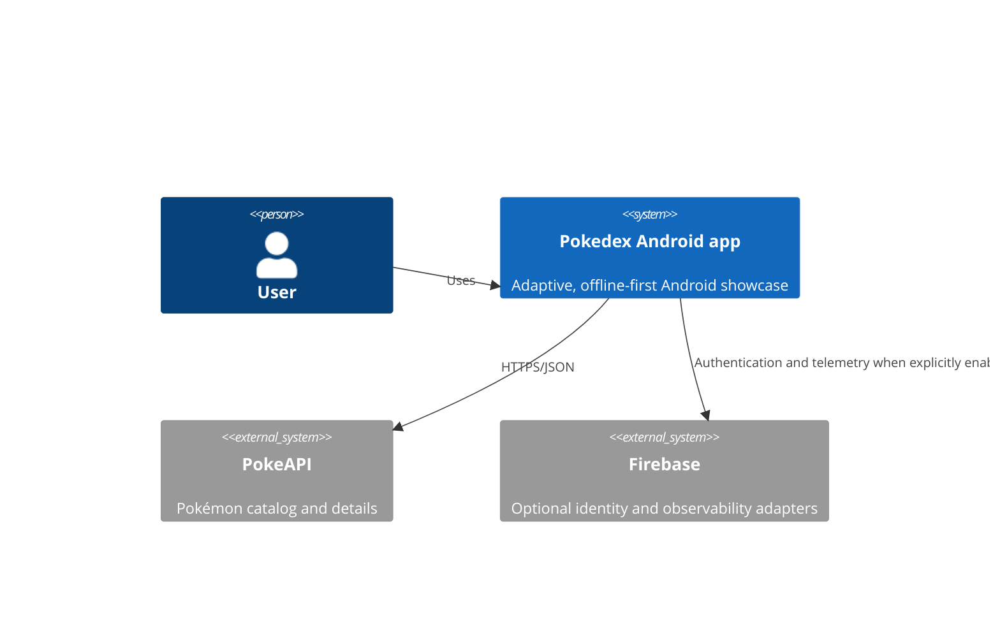
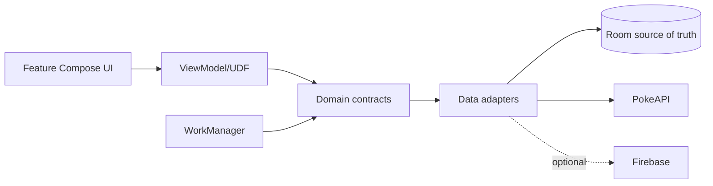

# Architecture decisions

## System context

## Containers and data flow

## ADR-001: module boundaries

`core:domain` has no project dependencies. `core:data` may depend on domain and common
infrastructure, never UI or feature modules. `core:designsystem` accepts UI values and slots rather
than domain models. `verifyModuleBoundaries` enforces these constraints.

## ADR-002: pragmatic UDF

Features expose immutable state and callbacks. `BaseViewModel` is available where event/effect
machinery reduces complexity, but inheritance is not mandatory for simple screens.

## ADR-003: offline-first

Room is the paginated source of truth. `RemoteMediator` owns network pagination and transactional
cache updates. Favorite state survives remote refresh. Exported schemas and device migration tests
protect persisted data.

## ADR-004: demo and Firebase adapters

The default build uses deterministic local auth, no-op analytics, and local feature flags. A valid
`google-services.json` plus `-PFIREBASE_ENABLED=true` selects Firebase adapters through the same
domain contracts. Cloud SDK types never cross into feature modules.

## ADR-005: experimental APIs

Navigation 3, App Functions, and Compose Preview Screenshot Testing are deliberate showcase
choices. They remain isolated at app/feature boundaries and are listed as experimental in the
capability matrix.
